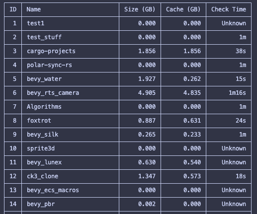

Recreational project. Please dont use it seriously.

Most things don't work completely as intended. It misses a lot of intended features and has a lot of bugs, especially the check time build check time stuff.
Please don't use this tool unless you want to take this codebase to make your own project manager and use ite as a starting point. If so, have fun and enjoy. 
For contributors: As this is just a fun project, there are not really any rules, but I enjoy to look at functional expressions.
I am especially interested in functional programming in Rust and trying to complety apply it to this project...

# License
This project is dual-licensed under:
- MIT License ([LICENSE-MIT](LICENSE-MIT))
- Apache License 2.0 ([LICENSE-APACHE](LICENSE-APACHE))

---

- [Installation](docs/Installation.md)
- [Motivation](docs/Motivation.md)
- [Complete Overview](docs/Overview.md)
- [Usage](docs/Usage.md)

# cargo-projects

A "Work-In-Progress" 
- and incomplete 
- and untested 
- and unstable
- CLI tool for managing Rust projects - list, track, and clean up your local cargo projects. 

Most things don't work completely as intended. Please don't use this tool unless you want to take this code to make your own proj

## Overview

`cargo-projects` helps you manage your local Rust development environment by:
1. tracking your projects, 
2. monitoring disk usage, 
3. and providing easy cleanup capabilities. 
4. tracking/automating unstaged/unpushed code before you completely delete a project ^^

$ > cargo projects list

